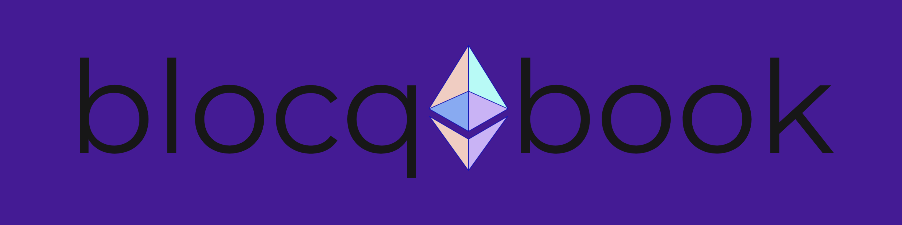
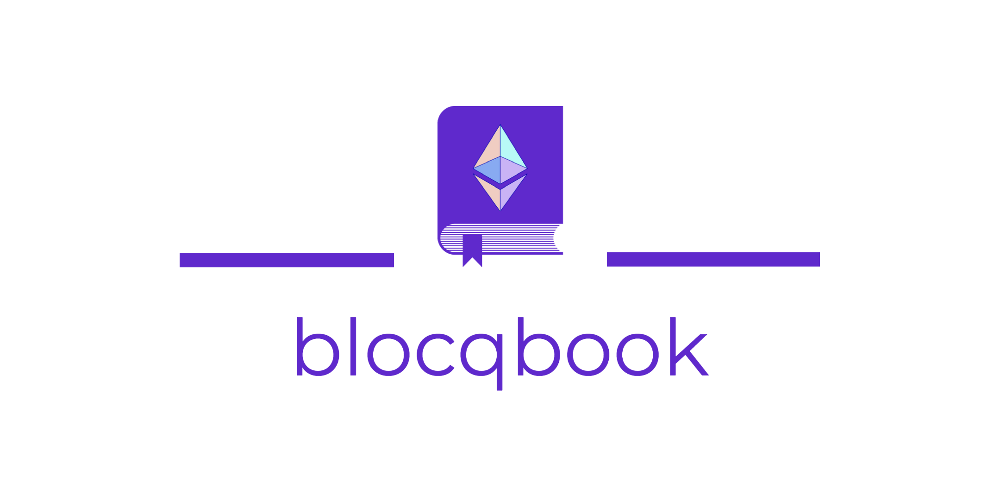
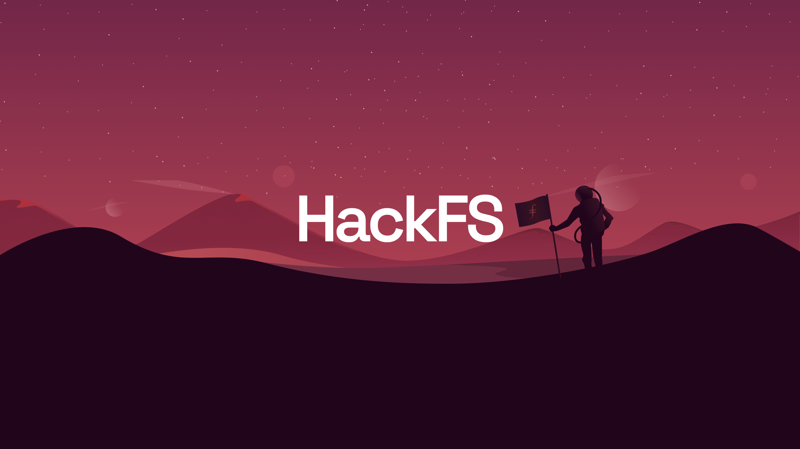

<!--  -->



# The Blocqbook

Picture a phonebook for the blockchain.

Or, if you never browsed the white-pages for your crush's number, an ios-contact app for all of the W3b.

We ship a fully-awesome web-3 app for retrieving transactions, contact management, instant messaging and peers2peer file transfer. Built by a team of 🌳 developers - [Florian Wolf](https://github.com/3lLobo) , [Julian Perassi](https://github.com/perassijulian) & [Reshma Shaik](https://github.com/TheReshma), this project lives up to the promise of decentralized WEB3. Your contact-data is 💯 owned by you and upwards compatible, for when you want to import your contacts to any interaction-based w3b-app (Metamask, XMTP, etc.). To launch this rocket of an app, connect your [Metamask](https://metamask.io/) wallet, and voila, your are ready for your interplanetary adventure! All your transactions have been fetched and you can now to chit-chat with your peers the decentralized way !

## Live Site

Try out our app here : [Blocqbook](https://blocqbook.netlify.app/)

For the oldest news, have an eye on your [local Newspaper](https://twitter.com/blocqbook)

## Covalent

The Blocqbook uses the [Covalent](https://www.covalenthq.com/) API to fetch transactions from the blockchain. All transactions are displayed in the transactions tab of the app. We display the token-balances of 13 chains in the profile section, namely -

```
Ethereum Mainnet
Kovan
Polygon
Polygon Mumbai
Binance Smart chain
Fantom
Fantom testnet
Arbitrium
Arbitrium Rinkeby
Avalanche
Avalanche Fuji
Harmony
Aurora
```

## Ceramic

Ceramic is our go to option for database as we wanted the app to be Web 3.0 and not Web 2.5 . We use [Ceramic](https://ceramic.network/) to initialize a database for every wallet registered. Users can connect their wallet and choose to link their pre-existing DID or get a new one. This way, all user data is stored in the blockchain. Blocqbook provides you the full data-driven web-experience, while collecting zero of your data. Check-out our [Ceramic Cook-Book](./ceramic/ceramicCookBook.md).

## XMTP

We use [XMTP](https://xmtp.com/) to enable decentralized messaging across wallets. To chat with an address, navigate to the 'Messenger' tab on the sidebar and Initiate a conversation by pasting your peer's address in the input area & hit the arrow button. Another way to initiate a conversation is to save a contact & then click on the chat icon in the contact card.

## IPFS

[IPFS](https://ipfs.io/) is awesome! The Blocqbook 💙 IPFS and uses it for decentralized, interplanetary file sharing, while saving you the hassle of juggling with CIDs. Navigate to the File Transfer tab & drop your files with the receiver's address or you can click on the IPFS icon on the receiver's contact card. The file is uploaded to IPFS and the CID is sent to the receiver via messenger powered by XMTP.

## Polygon & The Graph

The Blockbook's smart contract is deployed on [Polygon Mumbai](https://mumbai.polygonscan.com/) and emits an event every time an address is tagged with a public tag ( such as - `scam` or `airdrop` ). Our [The Graph](https://thegraph.com/hosted-service) subgraph indexes the events. All the addresses that have been given a public tag are now on the blockchain and can be graph-queried from [The Graph](https://thegraph.com/hosted-service) api. Possible use-cases are fraud detection & address identification. We build this feature in the hope to contribute to a safer and more transparent web3 🤍

Contract : [0xde4d7f0a42aa7df311b3cc18ef5231f501168695](https://mumbai.polygonscan.com/address/0xde4d7f0a42aa7df311b3cc18ef5231f501168695#events)

Subgraph : [Polygon](https://thegraph.com/hosted-service/subgraph/notthatdumb/contract-polygon)

## Poaps

Did we say [POAPS](https://poap.xyz/)? 🎉🎉🎉
Hell Yeah, we did. We are giving out POAPs to the early users of Blocqbook. Do grab one & mint them for free in the Gnosis chain. We also display POAPs of other wallets and notify when we have POAPs in common.



## Tech Stack

```
Next.js
React.js
Redux Toolkit
Tailwind CSS 💫
Ethers.js
```


